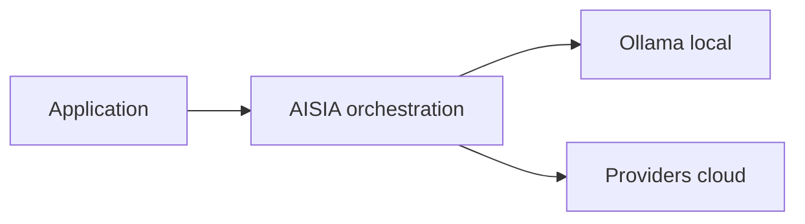

<!-- GENERATED:09_publications:start -->
<!--
  GÉNÉRÉ — ne pas éditer à la main.
  Source: scripts/generate/09_publications.py
  Régénérer: python3 scripts/aisia.py regen
  Gate deploy: python3 scripts/release/deploy.py <ver> --mode docs
-->

# terraform-scaleway-aisia

> **v6.12.42** — module registry — bootstrap Scaleway + substrat AISIA

## Cœur d'AISIA (identité produit)

AISIA est le **chef d'orchestre IA local-first** : une requête entre, le meilleur modèle (local ou cloud) exécute, la réponse sort traçable et gouvernée.

**Fonction première** : orchestrer chaque requête IA en **local-first** (Ollama sur cluster)
puis cloud si nécessaire — via `BanditRouter`, pas un simple reverse-proxy.

**Différenciation** : orchestration local-first — pas un proxy LLM stateless.

| vs proxy LLM | AISIA |
|--------------|-------|
| 1 provider fixe | **88** providers + **58** modèles locaux |
| Stateless | Qdrant + audit AI Act + multi-tenant |
| SaaS opaque | Déployable Swarm/K8s — **v6.12.42** LIVE |

Documentation : [README racine](../../../../README.md) ·
[Product Identity](../../../../specification/03-Project-State/Product-Identity-AISIA.md)




---
<!-- GENERATED:09_publications:end -->

## Architecture

```
Scaleway Project
  └─ Kapsule Cluster (type=kapsule, autoscaler balance + scale-down 5m)
       ├─ Node pool "primary" (DEV1-M × node_count, wait_for_pool_ready=true)
       └─ Node pool "gpu"    (L4-1-24G, autoscale 0→4, optionnel — gpu_enabled=true)
```

Région par défaut : `fr-par` (conformité RGPD).

## Usage

```hcl
provider "scaleway" {
  region = "fr-par"
  zone   = "fr-par-1"
  # Credentials via SCW_ACCESS_KEY / SCW_SECRET_KEY / SCW_DEFAULT_PROJECT_ID
}

provider "kubernetes" {
  host  = module.aisia_scw.cluster_endpoint
  token = module.aisia_scw.cluster_token
  cluster_ca_certificate = base64decode(module.aisia_scw.cluster_ca_certificate)
}

# L1 — substrat Kapsule
module "aisia_scw" {
  source  = "app.terraform.io/AISIA/aisia/scaleway"
  version = "~> 1.0"

  org_id      = "acme"
  service_key = "C1"
  image_tag   = "v6.12.42"
  tier        = "saas"

  region      = "fr-par"
  node_count  = 2
  node_type   = "PRO2-S"
}

# L2 — déploiement AISIA
module "aisia_app" {
  source  = "app.terraform.io/AISIA/aisia-cluster/kubernetes"
  version = "~> 1.0"

  image_tag = "v6.12.42"
  tier      = "saas"
  domain    = "acme.aisia.fr"
}
```

## Inputs

| Nom | Description | Type | Défaut | Requis |
|-----|-------------|------|--------|--------|
| `org_id` | Identifiant de l'organisation AISIA (tenant) | `string` | — | oui |
| `service_key` | Brique déployée (C1..C11) | `string` | — | oui |
| `runtime_kind` | edge \| compute \| compute-gpu \| data \| ops \| security | `string` | `"compute"` | non |
| `substrate` | Substrat cible (ce module = k8s) | `string` | `"k8s"` | non |
| `profile` | Profil de dimensionnement (S \| M \| L \| XL) | `string` | `"S"` | non |
| `node_count` | Nombre de nœuds du pool principal Kapsule | `number` | `1` | non |
| `image_registry` | Registry des images AISIA | `string` | `"registry.aisia.fr"` | non |
| `image_tag` | Tag d'image AISIA à déployer | `string` | `"v6.12.42"` | non |
| `domain` | Domaine custom (vide = *.aisia.fr) | `string` | `""` | non |
| `tier` | Offre tarifaire (saas \| baas \| paas) | `string` | `"saas"` | non |
| `gpu_enabled` | Provisionner un pool GPU Kapsule | `bool` | `false` | non |
| `region` | Région Scaleway (fr-par = RGPD) | `string` | `"fr-par"` | non |
| `cluster_name` | Préfixe du cluster Kapsule | `string` | `"aisia-scaleway-k8s"` | non |
| `node_type` | Type d'Instance pool principal (DEV1-M = 3 vCPU / 4 GB ; prod : PRO2-S) | `string` | `"DEV1-M"` | non |
| `k8s_version` | Version Kubernetes Kapsule (ex : 1.30) | `string` | `"1.30"` | non |
| `cni` | CNI Kapsule (cilium \| calico \| flannel \| kilo) | `string` | `"cilium"` | non |
| `gpu_node_type` | Type Instance GPU optionnel (L4-1-24G, RENDER-S) | `string` | `"L4-1-24G"` | non |

## Outputs

| Nom | Description | Sensible |
|-----|-------------|----------|
| `cluster_id` | ID du cluster Kapsule | non |
| `cluster_name` | Nom du cluster Kapsule | non |
| `cluster_endpoint` | Endpoint API server Kapsule (apiserver_url) | oui |
| `kubeconfig` | Kubeconfig complet (config_file) | oui |
| `cluster_token` | Token d'authentification Kapsule | oui |
| `cluster_ca_certificate` | CA certificate Kapsule (base64) | oui |
| `region` | Région Scaleway du déploiement | non |
| `node_count` | Taille du pool principal | non |
| `gpu_pool_enabled` | Pool GPU provisionné ? | non |

## Prérequis

- OpenTofu >= 1.5 ou Terraform >= 1.5
- Provider `scaleway/scaleway ~> 2.40`
- Credentials Scaleway via env vars `SCW_ACCESS_KEY` / `SCW_SECRET_KEY` /
  `SCW_DEFAULT_ORGANIZATION_ID` / `SCW_DEFAULT_PROJECT_ID`
- Module `terraform-aisia-cluster ~> 1.0` pour déployer l'application

## Licence

[Mozilla Public License 2.0](LICENSE) — Copyright (c) 2026 AISIA (Sébastien Lambert).

## Référence des variables & sorties (auto-générée)

<!-- BEGIN_TF_DOCS -->
<!-- END_TF_DOCS -->

<!-- TF-MODULE-DOCS:09_publications -->
## Documentation AISIA

- **Documentation produit** : [aisia.fr/docs](https://aisia.fr/docs)
- **Référence API** : [api.aisia.fr/docs](https://api.aisia.fr/docs)
- **Provider Terraform** : [aisia-foundation/aisia](https://registry.terraform.io/providers/aisia-foundation/aisia/latest/docs)
- **Guide d'implémentation** : [getting-started](https://registry.terraform.io/providers/aisia-foundation/aisia/latest/docs/guides/getting-started)
- **Version LIVE** : **v6.12.42**
